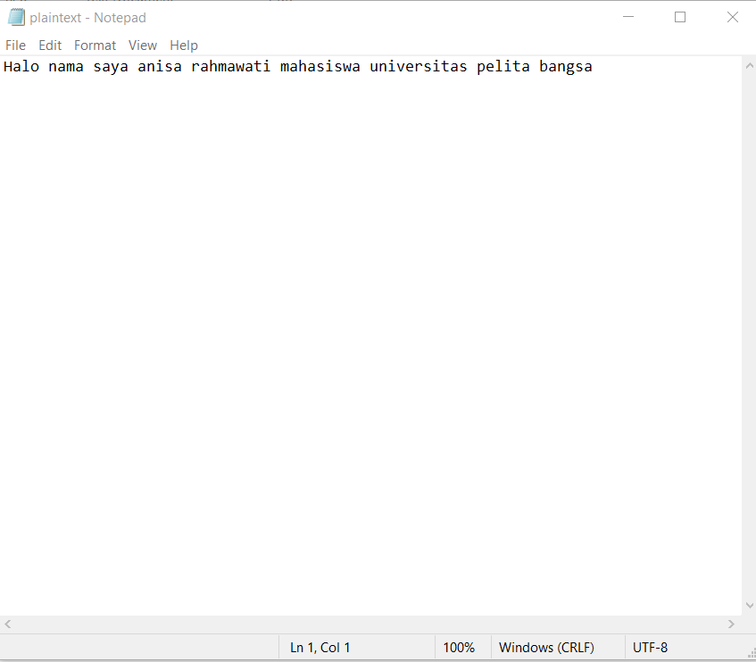

# Kriptografi
Tugas Pertemuan 14 Semester 5
                                                       # Coding  XOR Enkripsi & Deskripsi Menggunakan Code Block
                                                       
    1. Screenshot Plaintext                                                   

   2. Screenshot Pemanggilan Melalui CMD Untuk Enkripsi

    3. Menampilkan Hasil Enkripsi

     4. Pemanggilan Melalui CMD untuk Deskripsi
  
 
      5. menampilkan Hasil Deskripsi

